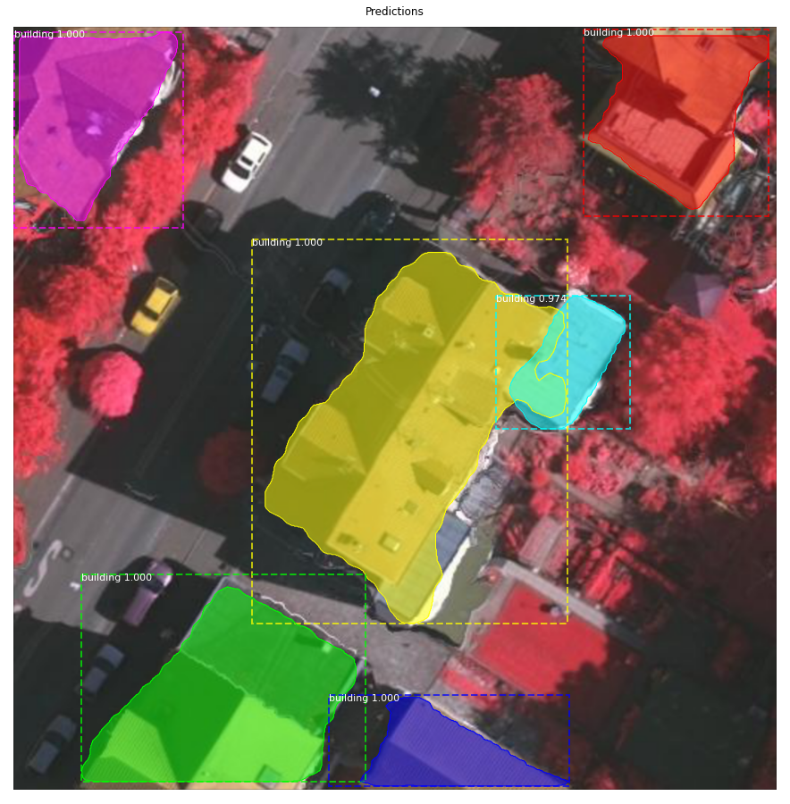

# Instance-Seg-MRCNN-Building

In this repo, I explored training a Mask RCNN on a custom dataset. The custom dataset I chose to train on was the Vaihingen Dataset. I followed [this](https://medium.com/analytics-vidhya/instance-segmentation-using-mask-r-cnn-on-a-custom-dataset-78631845de2a) tutorial to set up my workspace. 

### Steps
1. clone this repo
2. download the coco weights ([mask_rcnn_coco.h5](https://drive.google.com/drive/u/1/folders/10dUGbji1CY0nkQRIgr5Kph6setR_Z2zg)) and place them in the root of this repo
2. upload the mask-rcnn directory to your google drive
3. open the two .ipynb files in a Google Collab Notebook. The notebooks describe what versions of tensorflow and keras are required to train your model. Make sure to use a GPU runtime environment.
	- building_2_train.ipynb: This notebook shows how to train your model on a custom dataset
	- inspect_building_model.ipynb: This notebook shows how to do inferences on your test set.
4. Preparing Datasets:
	- use [this](https://medium.com/analytics-vidhya/instance-segmentation-using-mask-r-cnn-on-a-custom-dataset-78631845de2a) tutorial to see how to prepare your custome dataset. In essense, you will need to use the VGG Annotator Tool to create a json file that will contain all the segmentation information.
	- If you want to use my dataset, place the contents of train.zip and val.zip ([here](https://drive.google.com/drive/u/1/folders/10dUGbji1CY0nkQRIgr5Kph6setR_Z2zg)) in the /samples/building/dataset/train and val, respectively. This will include the input RGB images as well as a via_region_data.json file, which has all the building annotations for all the images. This json was created using thr VGG annotator tool.
5. Evaluation metrics
	- Once you are done training your model, the inspect_building_model.ipynb will save your predictions as .npy files in mask-rcnn/samples/building/dataset/pred_npys on your google drive. Add the gt .npy files (found [here](https://drive.google.com/drive/u/1/folders/10dUGbji1CY0nkQRIgr5Kph6setR_Z2zg) for the Vaihingen dataset) to the same directory. Check out my repo [here](https://github.com/sendeb/image_segmentation_metrics_calc) to see how to calculate metrics, such as Dice, IoU, Weghted Coverage, and BoundF to evaluate your model's performance.
	- to run the calculate metics script
	```
	python calculate_metrics.py --path /path/to/your/vaihingen/pred_npys --dataset V
	```

Notes:
I was able to get 88% dice score by using the confgurations mentioned in [this](https://pdfs.semanticscholar.org/cf20/69916c48fb99129e7a9c9573736e72e5590f.pdf) paper. Please feel free to play around with the configurations further for your use case in mask-rcnn/mrcnn/config.py

